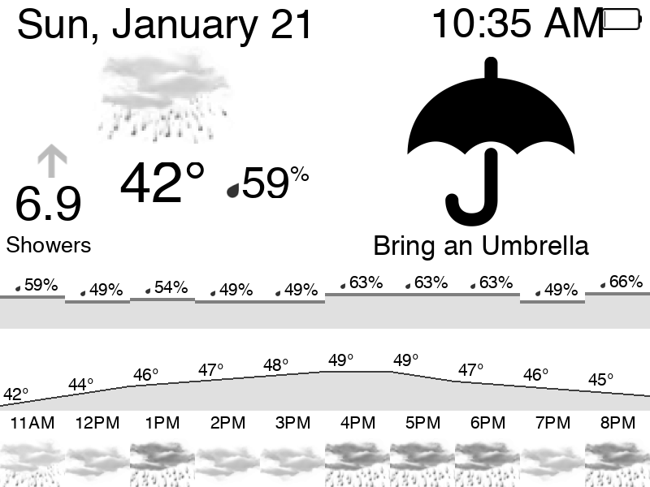

# Kindle Weather Display

A simple hourly weather display for a Kindle or other web-connected display.



## Server Setup

1. install apache2 with ImageMagic
2. Create `api_key.php` and place your accoweather API key in it
```php
<?php

$API_KEY = "...";

?>
```

3. Pull the latest forecast with cron.

```bash
crontab -e

59 * * * * cd /var/www/html; php pull_forecast.php
```

## Kindle Setup

1. Set up your Kindle to pull a web site every minute (out of scope of this project).
2. Point your Kindle etc. to `http://myserver.com/weather.php`

